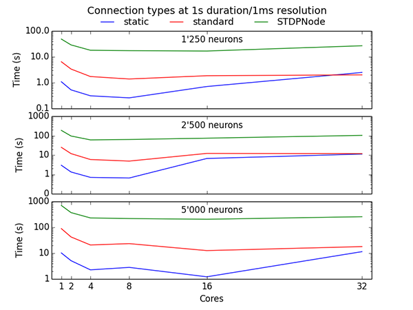
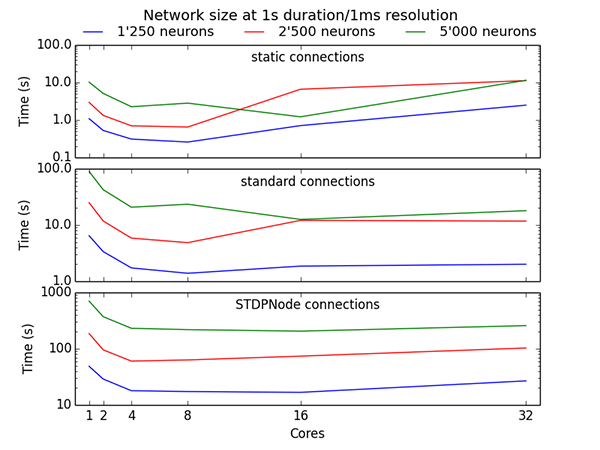
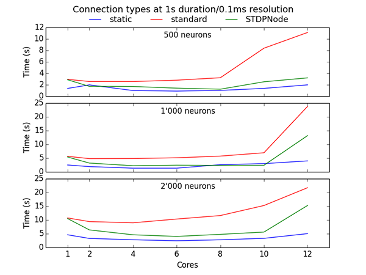
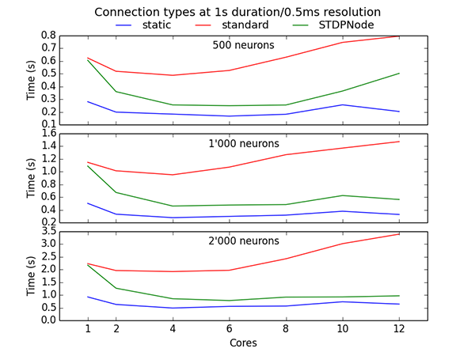
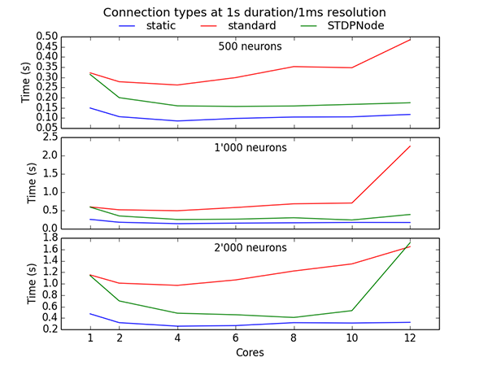

## A generalizable model of spike-timing dependent plasticity for the the Neural Simulation Tool ([NEST](https://github.com/nest/nest-simulator))

This is a bachelor semester project carried out at the [Laboratory of Computational Neuroscience](http://lcn1.epfl.ch) 
from [Swiss Institute of Technology in Lausanne](http://www.epfl.ch). It was supervised by 
[Alex Seeholzer](https://github.com/flinz) during fall semester 2015.

The project's goal was to evaluate how alternative spike-timing dependent plasticity (STDP) mechanisms can be implemented in the NEST simulator, facilitating the subsequent implementation of complex STDP rule and neuro-modulation.

### Introduction

The NEST Simulator is using `Node` as a base class for most of the components in a network.
One example is neurons extending `ArchivingNode` which is itself extending `Node`.
One opposite example is synapses only extending `Connection`.

As a result synapses do not benefit of the same dynamics as general nodes. 
On the one hand, their updates can only happen in an event-driven manner: changing theirs states can only be triggered by received events (one way only, from pre-synaptic to post-synaptic neuron).
On the other hand, neurons are receiving ticks at a rate of 1/resolution: states changes can happen as often as the resolution allows.

Some models of spike-timing dependent plasticity require complex dynamics and pre-to-post and post-to-pre triggers dependencies (e.g. Pfister 2006 or Zenke 2015).
In NEST this is currently doable, whenever an event is received in the synapse, by rebuilding and going through the history of the post-synaptic neuron.
However this process can be hard to achieve right and is longer to implement for the user.
This is why you will find in this module an alternative approach of synapses using an archiving node and two static connections as a base.

### Overview

#### Standard approach, using NEST-native event driven synapses


- synapse updates happen only on pre-synaptic spikes (event driven updates)
- dendritic delays have to be explicitly implemented in each STDP model
- limited access to post-synaptic variables
- limited neuro-modulation (see https://github.com/nest/nest-simulator/blob/master/models/volume_transmitter.h)
- directly available out of the box
- minimum delay is simulation resolution
- theoretically complete graph scales at **O(n^2)** connections for **n** neurons

#### STDPNode approach, using an [ArchivingNode](https://github.com/nest/nest-simulator/blob/master/nestkernel/archiving_node.h) and two static connections


- STDPNodes are updated in continuous time (via calibrate/update/handle)
- delays are externalized to connections into and out of the STDPNode
- all variables (e.g. synaptic traces) are located in the synapse
- allows flexible neuro-modulation through, e.g., custom events or additional spike receptors
- requires a DSL (pynest) or must follow a well defined *contract* (pre-neuron -> synapse, synapse -> post-neuron, post-neuron -> synapse on port **1** for feedback, see **Figure 1**)
- minimum delay is twice the simulation resolution
- theoretically complete graph scales at **O(4n^2)** connections for **n** neurons

### In this repository

- standard approach (root): 
    - triplet model (Pfister 2006), `stdp_triplet_all_in_one_synapse` is defined inside `stdp_triplet_connection.h` (difference with NEST 2.10 `stdp_synapse` is variables centralization)
- STDPNode approach (root):
    - triplet model (Pfister 2006), `stdp_triplet_neuron` is defined inside `stdp_triplet_neuron.{h,cpp}`
    - first version of long-term stable STDP model (Zenke 2015), `stdp_long_neuron` is defined inside `stdp_long_neuron.{h,cpp}` (no tests)
- tests:
    - triplet model (Pfister 2006), for both approaches (classical tests as well as visual decays tests)
- slides: [reveal.js](https://github.com/hakimel/reveal.js/) midterm and final presentations
- pynest:
    - STDPNode approach DSL example (do not handle all connections types, i.e. no indegree)
- examples:
    - standard approach for triplet model (Pfister 2006) pairing experiment
    - STDPNode approach with contract for triplet model (Pfister 2006) pairing experiment
    - STDPNode approach with DSL for triplet model (Pfister 2006) pairing experiment
    - STDPNode approach with contract for long-term stable STDP model (Zenke 2015) pairing experiment (parameters differ slightly from those in Zenke 2015)
- benchmarks:
    - a Brunnel balanced network with delta neuron (`iaf_psc_deta`): static connections vs standard approach vs STDPNode approach (through different network orders and cores)
    - a feedforward network (**n** pre-synaptic neurons connected to **1** post-synpatic neuron): static connections vs standard approach vs STDPNode approach (through different **n**, cores and resolutions)
- figures: benchmark results plots and illustrations
- cluster: command for deploying [NEST and this module over large Beowulf MPI-clusters on DigitalOcean](https://github.com/zifeo/nest-simulator-cluster)
    
### How to install this module

NEST simulator >= 2.8.0 is required (not tested below) before proceeding to further step. 
Otherwise please check out the official installation [steps](http://www.nest-simulator.org/installation/).

```bash
git clone --recursive https://github.com/zifeo/nest-stdpmodule.git stdpmodule
cd stdpmodule
./bootstrap.sh
./configure
make
make install
cd ..
rm -rf stdpmodule
```

### Domain specific language (DSL)

All content of pynest folder will be copied to nest installation folder and automatically available through python.
However depending on your installation it must sometimes be manually done (check last lines of `make install`).

The DSL offers the following facilities:

- `nest.helloSTDP()`: start this module and patch pynest accordingly
- `triplet_synapse = nest.Connect(pre, post, conn_spec = None, syn_spec = None, model = "stdp_triplet_neuron", pre_syn_spec = None, syn_post_spec = None)`: connect `pre` and `post` neurons through triplet model (Pfister 2006) and return associated neuron entity synapses 
- `nest.Spikes(neurons, times)`: send on-demand spikes to `neurons` at given range `times`

### Taranis

Independly from this project, [Taranis](https://github.com/zifeo/Taranis) is a related short proof of concept aiming to evaluate how can the [actor model](https://en.wikipedia.org/wiki/Actor_model) be implemented with STDP.
Using abstract "dynamics" (calibrate/update/handle) as building block, a neuron is composed three parts:

- post-connection dynamics: each incoming event will be arriving to the neuron through there
- neuron dynamics: care about post and pre calibrations and updates as well as its own dynamics
- pre-connection dynamics: each outgoing event will be leaving the neuron through there

All of those components can interact with each others and are including inside the same actor. 
Each event sent will be broadcasted to the neuron's successors as well as neuron's priors nodes.
Even though not everything above was implemented and tuned due to lack of time, Taranis can provide some insights for further work.
Performance are quite good for a few neurons but does not scale well due in part to JVM garbage collection and provided dispatcher.

### Benchmarks results

All the benchmarks were run **5** times on the same configuration (duration/precision compromise, some of them took hours to be completed).

#### Brunnel balanced network

Using delta neuron (`iaf_psc_deta`).




#### Feedforward

**n** pre-synaptic neurons connected to **1** post-synpatic neuron.





### License

All the work is provided under NEST [GNU General Public License 2 or later](http://www.nest-simulator.org/license/). See `LICENSE` for further details.

### References

- Eppler, Jochen Martin et al.. (2015). NEST 2.8.0.
- F. Zenke, E.J. Agnes and W. Gerstner, Diverse synaptic plasticity mechanisms orchestrated to form and retrieve memories in spiking neural networks, Nature Communications, Vol. 6, Nr. 6922, 2015.
- F. Zenke and W. Gerstner, Limits to high-speed simulations of spiking neural networks using general-purpose computers, Frontiers in neuroinformatics, Vol. 8, pp. 76, 2014.
- J.P. Pfister and W. Gerstner, Triplets of Spikes in a Model of Spike Timing-Dependent Plasticity, J. Neuroscience, Vol. 26, Nr. 38, pp. 9673-9682, 2006.
